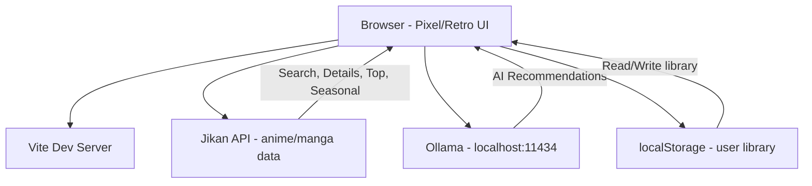

# Anime/Manga Tracker with AI Recommendations

A personal-use web application to track anime/manga with a pixel/retro NES-style UI and AI-powered recommendations powered by a locally-run LLM (Ollama).

## User Review Required

> [!IMPORTANT]
> **LLM Provider**: This plan uses **Ollama** (`http://localhost:11434`) as the local LLM backend. It will be configured to use your requested `qwen 3.5 9b` model (we will use the appropriate tag like `qwen2.5:7b` or whatever exactly you've pulled in Ollama).

> [!IMPORTANT]
> **Data Persistence**: For a personal-use app, I'll use **localStorage** to store your anime/manga library. This is the simplest approach — no database needed, but data is tied to the browser. Would you prefer a file-based backend (JSON file) instead?

> [!IMPORTANT]
> **Anime Data Source**: I'll use the **Jikan API** (free unofficial MyAnimeList API) for anime/manga search, details, and cover images. No API key required. Rate limit: 60 requests/min. Is this acceptable?

---

## Architecture Overview



**Stack**: HTML + Vanilla CSS + JavaScript, Vite dev server, NES.css framework, Jikan REST API v4, Ollama local LLM

---

## Proposed Changes

### Core Setup

#### [NEW] [package.json](file:///c:/Users/Granbell/anime-manga-tracker/package.json)
- Vite as dev server
- No additional dependencies (NES.css via CDN, all vanilla JS)

#### [NEW] [vite.config.js](file:///c:/Users/Granbell/anime-manga-tracker/vite.config.js)
- Basic Vite config for multi-page or SPA setup

---

### Entry Point & Layout

#### [NEW] [index.html](file:///c:/Users/Granbell/anime-manga-tracker/index.html)
- Main HTML page with NES.css CDN link + pixel font (Press Start 2P from Google Fonts)
- Navigation bar with pixel-styled tabs: **Dashboard**, **Browse**, **My Library**, **AI Advisor**
- Container div for SPA-style page rendering
- SEO meta tags

---

### Styling

#### [NEW] [src/styles/main.css](file:///c:/Users/Granbell/anime-manga-tracker/src/styles/main.css)
- Custom retro color scheme (dark background, CRT-like glow effects)
- NES.css overrides and extensions
- Layout system (grid/flex for card layouts)
- Animations: scanline overlay, pixel fade-in, screen flicker transitions
- Responsive design for different screen sizes
- Custom scrollbar styled to match retro theme
- Card styles for anime/manga items with pixelated borders

---

### JavaScript Modules

#### [NEW] [src/main.js](file:///c:/Users/Granbell/anime-manga-tracker/src/main.js)
- App initialization, router setup, event wiring
- SPA-style navigation between pages

#### [NEW] [src/router.js](file:///c:/Users/Granbell/anime-manga-tracker/src/router.js)
- Simple hash-based router (`#/dashboard`, `#/browse`, `#/library`, `#/ai`)
- Page render function dispatcher

#### [NEW] [src/api/jikan.js](file:///c:/Users/Granbell/anime-manga-tracker/src/api/jikan.js)
- Jikan API wrapper (`https://api.jikan.moe/v4/`)
- Functions:
  - `searchAnime(query, page)` - search anime by name
  - `searchManga(query, page)` - search manga by name
  - `getAnimeById(id)` - get anime details
  - `getAnimeEpisodes(id)` - get list of episodes for an anime
  - `getMangaById(id)` - get manga details
  - `getTopAnime(page, filter)` - top anime list
  - `getTopManga(page, filter)` - top manga list
  - `getSeasonNow()` - currently airing anime
  - `getAnimeRecommendations(id)` - MAL recommendations for an anime
- Built-in rate limiting (max 3 req/s)
- Response caching with TTL

#### [NEW] [src/api/ollama.js](file:///c:/Users/Granbell/anime-manga-tracker/src/api/ollama.js)
- Ollama API wrapper (`http://localhost:11434/api/chat`)
- Functions:
  - `getRecommendations(userLibrary, context)` - sends user's watch history + dynamically fetched Jikan context to the LLM.
  - `chatWithAdvisor(message, history, jikanContext)` - conversational AI.
  - `checkConnection()` - verify Ollama is running.
- **API-Driven RAG**: To ensure the AI doesn't hallucinate anime details, the app will perform hidden searches to the Jikan API based on the user's prompts, fetch real synopses, and inject them as context into the Qwen prompt (Retrieval-Augmented Generation without a vector database).
- Streaming response support for real-time text display.
- System prompt engineering for an anime expert persona.

#### [NEW] [src/store/library.js](file:///c:/Users/Granbell/anime-manga-tracker/src/store/library.js)
- localStorage-based data store for user library
- Data model per entry:
  ```json
  {
    "mal_id": 1,
    "title": "Cowboy Bebop",
    "image_url": "...",
    "type": "anime",
    "status": "completed",
    "user_rating": 9,
    "episodes_watched": 26,
    "total_episodes": 26,
    "watched_episodes_list": [1, 2, 3, 4], // Array of specific episode numbers marked as watched
    "notes": "...",
    "date_added": "2026-03-30",
    "genres": ["Action", "Sci-Fi"]
  }
  ```
- CRUD operations: add, update, remove, getAll, getByStatus, getByType
- Statistics: total watched, average rating, genre breakdown
- Import/Export as JSON file (for backup)

---

### Pages / Views

#### [NEW] [src/pages/dashboard.js](file:///c:/Users/Granbell/anime-manga-tracker/src/pages/dashboard.js)
- **Welcome banner** with pixel art and retro greeting
- **Stats panel** (NES.css containers): total anime watched, manga read, average rating, hours spent
- **Currently watching/reading** section (horizontal scrolling cards)
- **Recently added** section
- **Quick actions**: Add new, Browse trending, Get AI recommendation

#### [NEW] [src/pages/browse.js](file:///c:/Users/Granbell/anime-manga-tracker/src/pages/browse.js)
- **Search bar** (NES.css input) with anime/manga toggle
- **Search results** grid with cover art, title, score, episodes
- **Tabs**: Top Anime, Top Manga, This Season, Search
- **Anime/Manga detail modal**: synopsis, genres, score, episodes, stats from MAL
- **Add to library** button on each item with status selector
- **Pagination** with pixel-styled page buttons

#### [NEW] [src/pages/library.js](file:///c:/Users/Granbell/anime-manga-tracker/src/pages/library.js)
- **Filter tabs**: All, Watching, Completed, Plan to Watch, On Hold, Dropped
- **Sort options**: by title, rating, date added
- **Library grid/list view** toggle
- **Episode Tracker**: Modal to view a full list of episodes for an anime, with individual checkboxes to mark each episode as watched, clearly identifying the last watched episode.
- **Edit entry** modal: update status, rating, overall progress
- **Remove from library** with pixel confirm dialog
- **Import/Export** buttons (JSON backup/restore)
- **Search within library**

#### [NEW] [src/pages/ai-advisor.js](file:///c:/Users/Granbell/anime-manga-tracker/src/pages/ai-advisor.js)
- **Retro terminal/chat UI** styled like an old RPG dialog box
- **Connection status** indicator for Ollama
- **Quick recommendation** button: auto-sends library data to LLM for personalized recommendations
- **Chat interface**: type freely to ask about anime ("What should I watch if I liked Steins;Gate?")
- **Streaming response** with typewriter effect (pixel character by character)
- **Recommendation cards**: AI-suggested anime displayed as clickable cards that link to browse/details
- **Preference presets**: "Something dark", "Feel-good comedy", "Action-packed", etc.

---

### Components

#### [NEW] [src/components/anime-card.js](file:///c:/Users/Granbell/anime-manga-tracker/src/components/anime-card.js)
- Reusable card component for anime/manga items
- Cover image with `image-rendering: pixelated` option
- Title, score (NES.css star rating), episode count
- Hover effect with pixel glow
- Quick-add button overlay

#### [NEW] [src/components/modal.js](file:///c:/Users/Granbell/anime-manga-tracker/src/components/modal.js)
- Reusable NES.css dialog modal
- Detail view, edit entry, confirm delete patterns

#### [NEW] [src/components/toast.js](file:///c:/Users/Granbell/anime-manga-tracker/src/components/toast.js)
- Pixel-styled notification toasts (added to library, saved, error, etc.)

#### [NEW] [src/components/loading.js](file:///c:/Users/Granbell/anime-manga-tracker/src/components/loading.js)
- Retro loading animations (bouncing pixel sprite, progress bar)

---

## UI Design Details

### Color Palette
| Role | Color | Hex |
|---|---|---|
| Background | Deep navy/black | `#0f0f23` |
| Surface | Dark blue-gray | `#1a1a3e` |
| Primary | Pixel green (retro terminal) | `#00ff41` |
| Secondary | Pixel amber | `#ffb000` |
| Accent | Pixel cyan | `#00d4ff` |
| Error/Remove | Pixel red | `#ff0040` |
| Text Primary | Off-white | `#e0e0e0` |
| Border | Soft pixel gray | `#4a4a6a` |

### Visual Effects
- **CRT scanline overlay** (subtle, togglable)
- **Screen flicker** on page transitions
- **Pixel fade-in** for cards loading
- **Typewriter effect** for AI responses
- **Glowing borders** on hover (box-shadow with color spread)
- **NES-style icons** for status, ratings, navigation

### Font
- **Press Start 2P** (Google Fonts) — authentic pixel font

---

## Open Questions

> [!NOTE]
> 1. **Any specific anime tracking features** you want beyond the basics and the detailed episode checklist? For example: watchlist sharing, MAL import, seasonal tracking?

---

## Verification Plan

### Automated Tests
- Run `npm run dev` and verify the dev server starts
- Test all Jikan API endpoints work (search, top, seasonal)
- Test localStorage CRUD operations via browser console
- Test Ollama connection and recommendation flow

### Manual Verification
- Navigate through all 4 pages and verify pixel/retro styling
- Add anime to library, edit, remove — verify persistence across reloads
- Use AI advisor to get recommendations and verify streaming output
- Test responsive layout on different browser widths
- Browser recording of complete user flow
